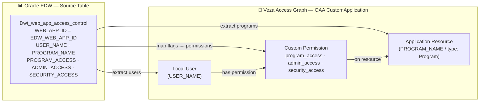

# EDW Security → Veza OAA Integration

## 1. Overview

This connector reads access-control records from the Oracle database table
`Dwt_web_app_access_control` and pushes them into Veza's Access Graph as an
OAA `CustomApplication`.  Once the data is in Veza, security teams can answer
questions such as:

- Who has `admin_access` to which EDW programs?
- Which users have `security_access` but no business justification?
- Which programs have the most privileged users?

### Entity model

| Source field      | OAA entity type          | Notes                          |
|-------------------|--------------------------|--------------------------------|
| `USER_NAME`       | Local User               | One per unique account         |
| `PROGRAM_NAME`    | Application Resource     | Type: `Program`                |
| `PROGRAM_ACCESS`  | Custom Permission        | Maps to `DataRead`             |
| `ADMIN_ACCESS`    | Custom Permission        | Maps to `DataRead + DataWrite + MetadataRead + MetadataWrite` |
| `SECURITY_ACCESS` | Custom Permission        | Maps to `DataRead + MetadataRead` |

### OAA permission mapping

| Permission name    | OAAPermission flags                                  |
|--------------------|------------------------------------------------------|
| `program_access`   | `DataRead`                                           |
| `admin_access`     | `DataRead`, `DataWrite`, `MetadataRead`, `MetadataWrite` |
| `security_access`  | `DataRead`, `MetadataRead`                           |

---

## 2. Entity Relationship Map



---

## 3. How It Works

1. **Load config** — credentials are read from the `.env` file (or environment
   variables), CLI flags provide overrides.
2. **Connect to Oracle** — opens a thin Oracle connection using `oracledb`
   (no Oracle Instant Client required).
3. **Query** — runs a parameterized `SELECT` against `Dwt_web_app_access_control`
   filtered by `WEB_APP_ID`.
4. **Build OAA payload** — constructs a `CustomApplication` object; for each
   row, adds the user (once), adds the program resource (once), and grants the
   applicable permissions.
5. **Push to Veza** — calls `OAAClient.push_application()` which creates or
   updates the provider and datasource automatically.

Milestones are logged at `INFO` level and printed to the console so progress is
visible when running interactively or in a cron job.

---

## 4. Prerequisites

| Requirement           | Notes                                                    |
|-----------------------|----------------------------------------------------------|
| Python 3.9+           | `python3 --version`                                      |
| Network access        | TCP to Oracle DB host on configured port                 |
| Network access        | HTTPS (443) to your Veza tenant URL                      |
| Oracle DB account     | `SELECT` on `Dwt_web_app_access_control`                 |
| Veza API key          | OAA write permissions required                           |
| `oracledb` thin mode  | No Oracle Instant Client needed (pure Python)            |

---

## 5. Quick Start

Once the repository is published, install with one command:

```bash
curl -fsSL https://raw.githubusercontent.com/YOUR_ORG/YOUR_REPO/main/integrations/edw-security/install_edw_security.sh | bash
```

The installer will prompt for all required values (Oracle host, port, SID,
credentials, WEB_APP_ID, Veza URL, API key).

---

## 6. Manual Installation

### RHEL / CentOS / Amazon Linux

```bash
# System packages
sudo dnf install -y python3 python3-pip git

# Clone the repository
git clone https://github.com/YOUR_ORG/YOUR_REPO.git
cd YOUR_REPO/integrations/edw-security

# Virtual environment
python3 -m venv venv
source venv/bin/activate
pip install -r requirements.txt

# Configure credentials
cp .env.example .env
chmod 600 .env
vi .env   # fill in all values
```

### Ubuntu / Debian

```bash
sudo apt-get update && sudo apt-get install -y python3 python3-pip python3-venv git

git clone https://github.com/YOUR_ORG/YOUR_REPO.git
cd YOUR_REPO/integrations/edw-security

python3 -m venv venv
source venv/bin/activate
pip install -r requirements.txt

cp .env.example .env
chmod 600 .env
nano .env   # fill in all values
```

### `.env` configuration

Edit `.env` (created from `.env.example`) and set:

```ini
EDW_DB_HOST=your-oracle-db-host.example.com
EDW_DB_PORT=1526
EDW_DB_SERVICE=your_oracle_sid
EDW_DB_USER=your_service_account
EDW_DB_PASSWORD=your_password
EDW_WEB_APP_ID=100005

VEZA_URL=https://your-tenant.veza.com
VEZA_API_KEY=your_veza_api_key
```

---

## 7. Usage

```
python3 edw_security.py [OPTIONS]
```

| Argument              | Required | Default        | Description                                   |
|-----------------------|----------|----------------|-----------------------------------------------|
| `--env-file PATH`     | No       | `.env`         | Path to credentials file                      |
| `--veza-url URL`      | *        | `VEZA_URL`     | Veza tenant URL                               |
| `--veza-api-key KEY`  | *        | `VEZA_API_KEY` | Veza API key                                  |
| `--provider-name`     | No       | `EDW Security` | OAA provider name                             |
| `--datasource-name`   | No       | `EDW Security` | OAA datasource name                           |
| `--db-host HOST`      | *        | `EDW_DB_HOST`  | Oracle DB hostname                            |
| `--db-port PORT`      | No       | `1526`         | Oracle DB listener port                       |
| `--db-service SID`    | *        | `EDW_DB_SERVICE` | Oracle DB SID                               |
| `--db-user USER`      | *        | `EDW_DB_USER`  | Oracle DB username                            |
| `--db-password PASS`  | *        | `EDW_DB_PASSWORD` | Oracle DB password                         |
| `--web-app-id ID`     | *        | `EDW_WEB_APP_ID` | WEB_APP_ID filter value                     |
| `--dry-run`           | No       | `false`        | Build payload without pushing to Veza         |
| `--save-json`         | No       | `false`        | Save OAA payload JSON to disk                 |
| `--log-level LEVEL`   | No       | `INFO`         | DEBUG / INFO / WARNING / ERROR                |

`*` Required unless `--dry-run` (Veza args) or set via matching env var.

### Examples

```bash
# Dry-run — build payload, save JSON, no push
python3 edw_security.py --dry-run --save-json --log-level DEBUG

# Live push using .env
python3 edw_security.py --env-file .env

# Live push, override web-app-id for a different application
python3 edw_security.py --env-file .env --web-app-id 100006 --datasource-name "EDW Security 100006"

# Non-interactive with explicit flags (useful for testing)
python3 edw_security.py \
  --db-host db.example.com --db-service MYPROD \
  --db-user svcveza --db-password secret \
  --web-app-id 100005 \
  --veza-url https://mytenant.veza.com --veza-api-key mykey \
  --dry-run --save-json
```

---

## 8. Deployment on Linux

### Service account

```bash
# Create a dedicated, non-login service account
sudo useradd -r -s /bin/bash -m -d /opt/edw-security-veza edw-veza
sudo chown -R edw-veza:edw-veza /opt/edw-security-veza
sudo chmod 700 /opt/edw-security-veza/scripts
sudo chmod 600 /opt/edw-security-veza/scripts/.env
```

### SELinux (RHEL / CentOS)

```bash
getenforce
# If Enforcing, restore default context after copying files:
sudo restorecon -Rv /opt/edw-security-veza/scripts/
```

### Cron wrapper script

Create `/opt/edw-security-veza/scripts/run.sh`:

```bash
#!/usr/bin/env bash
set -uo pipefail
cd /opt/edw-security-veza/scripts
/opt/edw-security-veza/scripts/venv/bin/python3 edw_security.py \
  --env-file /opt/edw-security-veza/scripts/.env \
  --log-level INFO
```

```bash
chmod 700 /opt/edw-security-veza/scripts/run.sh
```

### Cron schedule

`/etc/cron.d/edw-security-veza`:

```cron
# EDW Security → Veza OAA — runs daily at 06:00
0 6 * * *  edw-veza  /opt/edw-security-veza/scripts/run.sh >> /opt/edw-security-veza/logs/cron.log 2>&1
```

### Log rotation

`/etc/logrotate.d/edw-security-veza`:

```
/opt/edw-security-veza/logs/*.log {
    daily
    rotate 30
    compress
    delaycompress
    missingok
    notifempty
    create 0640 edw-veza edw-veza
}
```

---

## 9. Multiple Instances

To monitor multiple WEB_APP_IDs, create a separate `.env` per instance:

```bash
cp .env .env.100005
cp .env .env.100006
# Edit .env.100006: set EDW_WEB_APP_ID=100006 and DATASOURCE_NAME="EDW Security 100006"
```

Run each with its own env file and stagger cron entries by a few minutes:

```cron
0 6 * * *  edw-veza  python3 /opt/edw-security-veza/scripts/edw_security.py --env-file /opt/edw-security-veza/scripts/.env.100005
5 6 * * *  edw-veza  python3 /opt/edw-security-veza/scripts/edw_security.py --env-file /opt/edw-security-veza/scripts/.env.100006
```

---

## 10. Security Considerations

- **`.env` permissions** — always `chmod 600`.  The installer enforces this.
- **Service account scope** — the Oracle account needs only `SELECT` on
  `Dwt_web_app_access_control`; grant no write or DDL privileges.
- **Veza API key rotation** — rotate the API key periodically and update `.env`.
- **No credentials in code or logs** — the script never logs passwords or API
  keys.  The `.env` file is excluded from source control via `.gitignore`.
- **SQL injection** — the Oracle query uses bind parameters (`:web_app_id`);
  no user-controlled input is interpolated into SQL strings.
- **File permissions** — the `scripts/` directory should be `chmod 700` and
  owned by the service account.

---

## 11. Troubleshooting

| Symptom | Likely cause | Fix |
|---------|-------------|-----|
| `oracledb.DatabaseError: ORA-01017` | Bad DB credentials | Check `EDW_DB_USER` / `EDW_DB_PASSWORD` in `.env` |
| `oracledb.DatabaseError: ORA-12541` | DB host unreachable | Confirm `EDW_DB_HOST` and `EDW_DB_PORT`; check firewall |
| `oracledb.DatabaseError: ORA-12505` | Wrong SID | Verify `EDW_DB_SERVICE` matches the Oracle SID |
| `OAAClientError … HTTP 401` | Bad Veza API key | Re-generate key in Veza → Settings → API Keys |
| `OAAClientError … HTTP 403` | API key lacks OAA write | Add OAA write permission to the key |
| `Missing required configuration: EDW_DB_HOST` | .env not loaded | Check `--env-file` path; ensure file exists |
| Empty payload (0 users) | No rows match WEB_APP_ID | Check `EDW_WEB_APP_ID` value; run query directly against Oracle |
| `ModuleNotFoundError: No module named 'oracledb'` | venv not activated or packages not installed | `source venv/bin/activate && pip install -r requirements.txt` |

### Enabling debug logging

```bash
python3 edw_security.py --env-file .env --log-level DEBUG --dry-run
```

Logs are written to `./logs/edw_security_<DDMMYYYY-HHMM>.log`.

---

## Changelog

### v1.0 — Initial Release
- Oracle thin-driver connection via `oracledb` (no Instant Client required)
- Parameterized query against `Dwt_web_app_access_control`
- Three custom OAA permissions: `program_access`, `admin_access`, `security_access`
- Five progress milestones logged to console and log file
- `--dry-run` and `--save-json` flags for safe testing
- Interactive and non-interactive installer with full OS support
